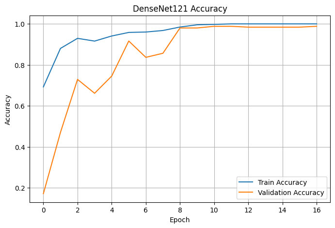
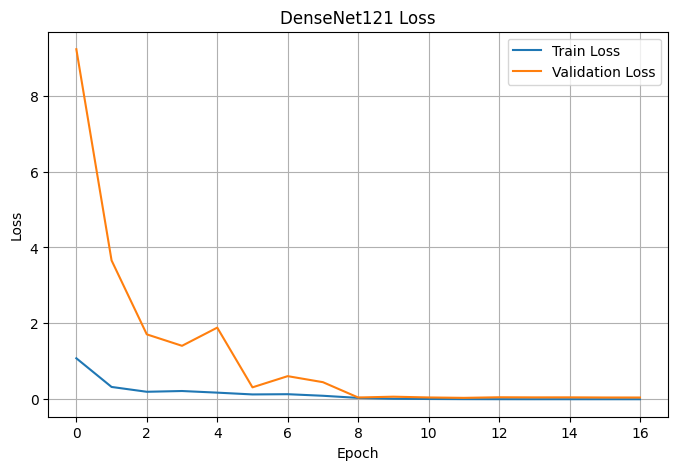
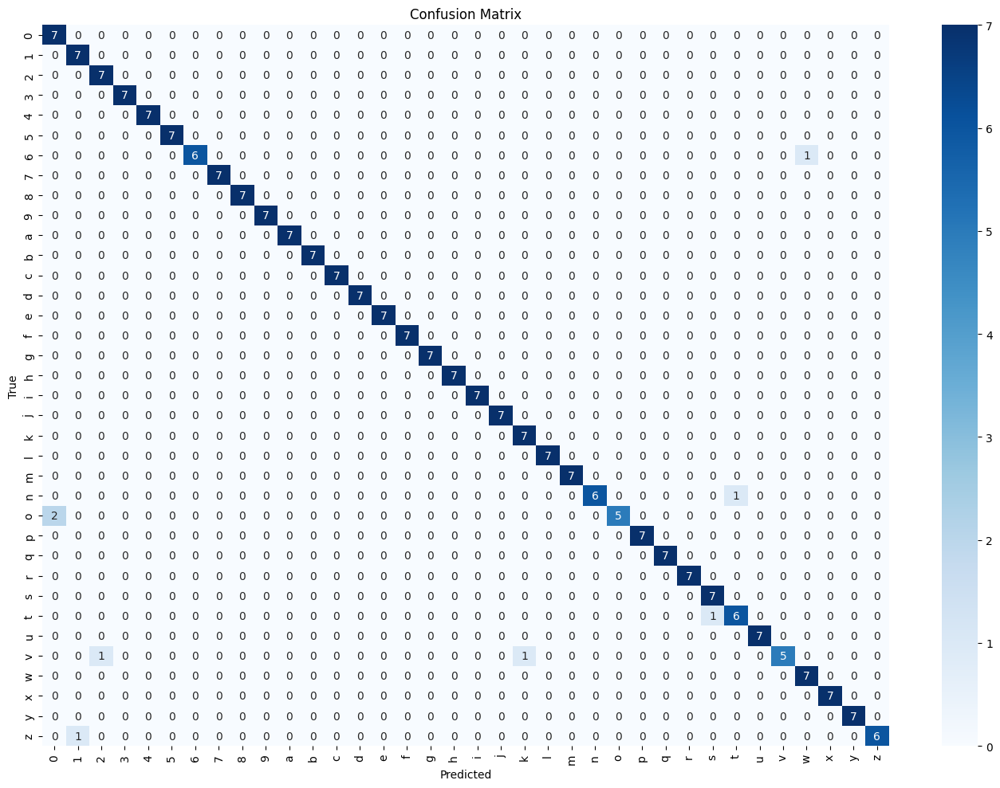

# American Sign Language (ASL) Gesture Recognition

## Dataset

I used the [Kaggle American Sign Language Dataset](https://www.kaggle.com/datasets/ayuraj/asl-dataset), which contains 36 classes representing:
- 26 alphabets (A-Z)
- 10 digits (0-9)

The dataset was split into:
- **Training**: 2012 images (80%)
- **Validation**: 251 images (10%)
- **Testing**: 252 images (10%)

All images were resized to **224x224 pixels** for uniformity.

Kaggle Notebook: [ASL Gesture Recognition](https://www.kaggle.com/code/fipro054/asl-gesture-recognition)

---

## Approach

I experimented with three different models to classify hand gestures:

- ✅ **Basic CNN**: Built from scratch using `Conv2D`, `MaxPooling2D`, `BatchNormalization`, and `Dense` layers.
- ✅ **DenseNet121**: Used transfer learning with pretrained weights on ImageNet.
- ✅ **EfficientNetB0**: Used transfer learning with pretrained weights on ImageNet.

---

## Data Preprocessing and Augmentation

- Images were **rescaled** to pixel values between **0 and 1**.
- Initially applied data augmentation (rotation, width/height shifts, zoom, horizontal flip) on training data.
  - ⚠️ However, augmentations caused **misclassification** between similar-looking gestures.
  - ❌ Therefore, augmentation was **removed** to maintain class distinctiveness.

---

## Training Strategy

Used the following **callbacks** for efficient training:
- `EarlyStopping`: Stops training if validation loss doesn't improve for 5 epochs.
- `ReduceLROnPlateau`: Lowers the learning rate when validation accuracy plateaus.

Training Parameters:
- **Batch size**: 32  
- **Epochs**: Up to 20

---

## Results

| Model           | Test Accuracy |
|----------------|----------------|
| DenseNet121     | 🥇 **96.83%** |
| Basic CNN       | 🥈 94.05%     |
| EfficientNetB0  | ❌ 2.78%      |

### Insights:
- **DenseNet121** performed the best due to its dense connectivity and efficient feature reuse.
- **Basic CNN** also achieved high accuracy, proving the effectiveness of simpler models on clean datasets.
- **EfficientNetB0** performed poorly, likely due to architectural mismatch or preprocessing issues.

---

## Visualizations

- 📈 **Training Curves**: Accuracy and loss plots showed consistent improvement for DenseNet121.
  
  

  
- 🔍 **Confusion Matrix**: Helped identify which gestures were most frequently confused.
 

---

## Conclusion

In this project, I developed and evaluated several models for ASL hand gesture classification. Among them, DenseNet121 delivered the highest performance, outperforming both the basic CNN and EfficientNetB0 models. This suggests that deeper transfer learning models can effectively capture complex patterns, especially when paired with clean and well-structured datasets. With the right architecture and training approach, high accuracy is achievable even in relatively straightforward classification tasks.

